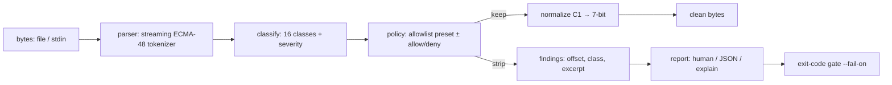

# seqsafe

[English](README.md) | [中文](README.zh.md) | [日本語](README.ja.md)

[](LICENSE) [](Cargo.toml) [](CHANGELOG.md) [](tests/) [](CONTRIBUTING.md)

**信頼できないターミナル出力のオープンソース・サニタイザー ― 色と安全なスタイルは残し、クリップボード書き込み・タイトル改変・デバイス照会・エスケープシーケンス注入の小細工を除去。許可リスト方式、依存ゼロ。**


```bash
git clone https://github.com/JaydenCJ/seqsafe.git && cargo install --path seqsafe
```

## なぜ seqsafe？

ターミナルは表示したものを実行してしまう。ログの一行、`curl` した README、LLM の出力の断片が、エスケープシーケンスを運び込む：コマンドをクリップボードへ書き込み（OSC 52）、ウィンドウタイトルを書き換え、ターミナルに stdin へ応答させ（DECRQSS が攻撃者のバイトを返した実在のターミナル CVE がある）、文字集合を再マップして監査済みのバイトを別の字形で描画させ、あるいはカーソルを戻して承認したばかりの行を書き換える ― そしてエージェント中心のワークフローは、かつてなく多くの信頼できないバイトをターミナルへ流し込んでいる。既存の答えは全か無かだ：`strip-ansi` や正規表現ワンライナーは*すべて*を消し、ビルドログは灰色になり、それでいて 8 ビット C1 導入子（`0x9B` に ESC は不要）や、寛容なターミナルが平気で解釈する開きっぱなしのシーケンスは見逃す。seqsafe はこれを本来のセキュリティ問題として扱う：ストリーミング ECMA-48 パーサーが 16 クラスの意味分類器へ送り、許可リストポリシーが選んだものだけ（SGR スタイル、安全なスキームのハイパーリンク）を残して他をすべて除去する ― まだ発明されていないシーケンスも含めて。未知は即ち除去だからだ。`scan` は中に何が潜んでいたかを深刻度付きで報告し、パイプライン向けの JSON と終了コードゲートを備える。

|  | seqsafe | strip-ansi | sed/grep 正規表現 | less -R |
|---|---|---|---|---|
| フィルタしつつ色を保持 | はい（許可リスト） | いいえ（全除去） | 手書きで脆い | はい |
| OSC 52 クリップボード / タイトル / 照会の除去 | はい、クラス単位 | はい（他もろとも） | 大抵見逃す | いいえ（素通し） |
| 8 ビット C1 導入子（`0x9B` 等） | はい、UTF-8 対応 | CSI のみ | いいえ | 部分的 |
| 切断・接合シーケンスへの防御 | はい（フェイルクローズ） | いいえ | いいえ | いいえ |
| 検出レポート + 終了コードゲート | はい（`scan --json --fail-on`） | いいえ | いいえ | いいえ |
| ハイパーリンクのスキーム検証 | はい（OSC 8 許可リスト） | 除去 | いいえ | いいえ |
| 実行時依存 | 0 クレート | Node ランタイム | – | – |

<sub>比較は 2026-07-13 時点：npm の `strip-ansi` 7.x は自身の正規表現に合うものを全削除する ― そのパターンは 8 ビット CSI 導入子 `0x9B` は確かに拾うが、8 ビット OSC/DCS（`0x9D`、`0x90` など）や切断シーケンスは拾わない；`less -R` は SGR を生のまま出し、認識できるものだけキャレット表記にする。seqsafe は std のみの Rust。</sub>

## 特徴

- **良いものは残し、悪いものだけ除去** ― SGR の色/太字/下線と安全なスキームの OSC 8 ハイパーリンクは無傷で通過；クリップボード書き込み、タイトル改変、パレット差し替え、モード切替、文字集合再マップ、リセット、デバイス照会は通さない。
- **設計からフェイルクローズ** ― ポリシーは許可リスト：未知のシーケンス、このリリース後に発明されるシーケンス、切断・過長・制御バイト接合されたものはすべて除去され、決して素通りしない。
- **C1 バイパスを封鎖** ― 生の 8 ビット導入子（`0x9B` CSI、`0x9D` OSC など）を ESC 版と同様に解析しつつ、UTF-8 継続バイトは決して誤読しないので、日本語も émoji もバイト単位で無傷に通る。
- **削除ではなく監査証跡** ― 除去のたびにバイトオフセット・行番号・クラス・深刻度・制御文字をエスケープした抜粋を持つ「所見」を記録；`explain` は理由を添え、`--mark` はその場に可視の `⟨stripped:...⟩` プレースホルダーを残す。
- **パイプラインのゲート** ― `scan --fail-on critical` は失敗すべきときに限り 1 で終了し、`--json` はゲートウェイに構造化された証拠を渡す；保存する所見は 1000 件で頭打ちにし、悪意ある入力でメモリは膨らまない。
- **ストリーミング、依存ゼロ** ― 有界バッファのプッシュ型パーサーが GB 級ログを 64 KiB チャンクで処理し、どんな分割でも出力は同一；ツール全体が std のみの Rust。

## クイックスタート

インストール（Rust 1.75+ が必要）：

```bash
git clone https://github.com/JaydenCJ/seqsafe.git && cargo install --path seqsafe
```

同梱の攻撃コーパス ― 無害に見えるリリースノート 7 行 ― をスキャン：

```bash
seqsafe scan examples/poisoned.log
```

出力（実際の実行から採取）：

```text
L2 @87 [critical] clipboard (clipboard-write) stripped  ⟨ESC⟩]52;c;Y3VybCAtcyBodHRwOi8vZXZpbC5leGFtcGxlLnRlc…
L3 @148 [high] title (title-set) stripped  ⟨ESC⟩]0;security scan passed⟨BEL⟩
L4 @234 [medium] cursor (cursor-move) stripped  ⟨ESC⟩[2A
L4 @238 [medium] screen (erase-line) stripped  ⟨ESC⟩[2K
L4 @242 [medium] cursor (cursor-move) stripped  ⟨ESC⟩[1B
L4 @264 [medium] cursor (cursor-move) stripped  ⟨ESC⟩[1B
L5 @338 [medium] hyperlink (unsafe-link) stripped  ⟨ESC⟩]8;;file:///etc/passwd⟨ESC⟩\
L6 @398 [high] charset (charset-designate) stripped  ⟨ESC⟩(0
L6 @407 [high] charset (charset-designate) stripped  ⟨ESC⟩(B
L7 @453 [high] query (device-status-report) stripped  ⟨0x9B⟩6n
L7 @456 [medium] screen (erase-display) stripped  ⟨0x9B⟩2J
11 finding(s): 1 critical, 4 high, 6 medium, 0 low; 7 sequence(s) kept, 11 stripped; 496 bytes in, 358 bytes out
```

終了コードは 1（critical の所見あり）なので、`scan` はそのまま CI/ゲートウェイの関門になる。浄化はただのパイプ ― 色は残り、攻撃は消え、`--mark` が切除痕を見せる：

```bash
$ printf 'deploy \x1b[1;32mdone\x1b[0m\x1b]52;c;cm0gLXJmIH4=\x07 in 3s\n' | seqsafe clean --mark
deploy done⟨stripped:clipboard-write⟩ in 3s
```

典型的な使い所：`make 2>&1 | seqsafe`、`ssh host 'journalctl -u app' | seqsafe`、あるいは AI エージェントのツール出力とそれを描画するターミナルの間。パイプ上ではサブコマンドなしの `seqsafe` が `seqsafe clean` になり、オプションもそのまま効く（例：`… | seqsafe --policy strict`）。

## ポリシー

`--policy` でプリセットを選び、`--allow` / `--deny` で微調整する（クラス → シーケンスの完全な対応は [docs/classes.md](docs/classes.md)、または `seqsafe classes` を実行）：

| ポリシー | 保持 | 追加の挙動 |
|---|---|---|
| `default` | `sgr`、`hyperlink`（http/https/mailto のみ） | 単独 `\r` を許可（プログレスバー用） |
| `strict` | `sgr` | 単独 `\r` を破棄（行書き換えの小細工を殺す） |
| `plain` | なし | プレーンテキスト出力、strip-ansi 相当 |

```bash
seqsafe clean --policy strict --deny sgr --allow cursor,screen   # TUI passthrough, no colors
seqsafe clean --link-schemes https                               # https links only
seqsafe scan --json --fail-on high < untrusted.txt               # gate at high severity
```

`malformed` だけは `--allow` できないクラスだ：切断・接合されたシーケンスには安全に再送出できる形が存在しない。

## 検証

このリポジトリは CI を持たない。上記の主張はすべてローカル実行で検証される：`cargo test`（ユニット 81 + CLI 統合 9、すべてオフラインで決定的）と `bash scripts/smoke.sh` ― 後者はバイナリをビルドし、毒入りログを全サブコマンドに通し（チャンク境界の安全性を証明する 1 バイトずつの滴下パイプを含む）、`SMOKE OK` を出力しなければならない。

## アーキテクチャ



## ロードマップ

- [x] コアエンジン：ストリーミングパーサー、16 クラス分類器、許可リストポリシー、ハイパーリンク検証、C1 正規化、scan/clean/explain/classes CLI、JSON レポート、終了コードゲート
- [ ] `tui` プリセット：cursor/screen/mode クラスも保持して全画面プログラムを素通しする
- [ ] ライブラリクレートの仕上げ：安定した公開 API ドキュメントと `no_std + alloc` コア
- [ ] SGR サブセットフィルタ（例：色は残して点滅/隠蔽を落とす）とクラス別 `--mark` スタイル
- [ ] Windows コンソール（VT 入力の癖）のテストカバレッジ

完全な一覧は [open issues](https://github.com/JaydenCJ/seqsafe/issues) を参照。

## コントリビュート

コントリビュート歓迎 ― [CONTRIBUTING.md](CONTRIBUTING.md) を参照し、[good first issue](https://github.com/JaydenCJ/seqsafe/issues?q=is%3Aissue+is%3Aopen+label%3A%22good+first+issue%22) から始めるか、[discussion](https://github.com/JaydenCJ/seqsafe/discussions) を開いてほしい。フィルタのバイパスは脆弱性である：非公開で報告してほしい（CONTRIBUTING.md の Security 節を参照）。

## ライセンス

[MIT](LICENSE)
