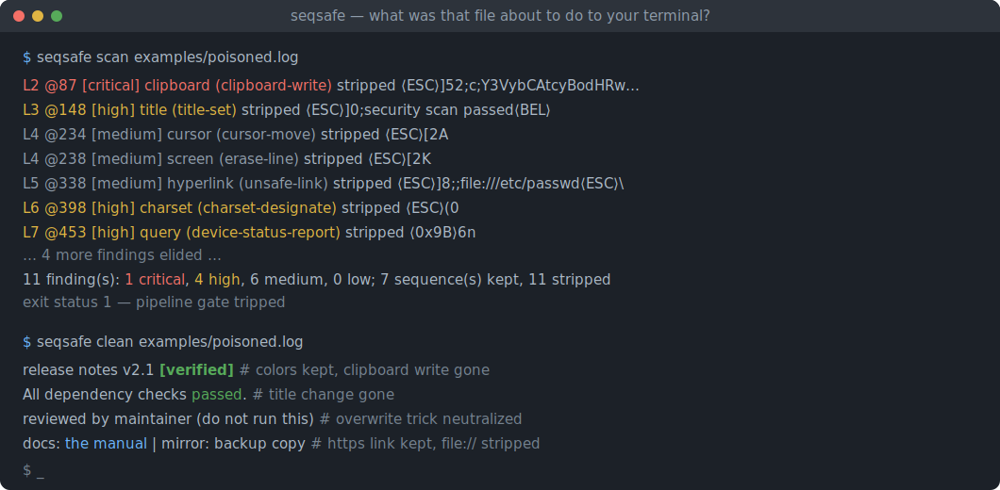
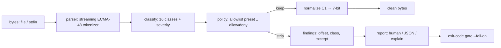

# seqsafe

[English](README.md) | [中文](README.zh.md) | [日本語](README.ja.md)

[](LICENSE) [](Cargo.toml) [](CHANGELOG.md) [](tests/) [](CONTRIBUTING.md)

**An open-source sanitizer for untrusted terminal output — keeps colors and safe styling, strips clipboard writes, title changes, queries and escape-injection tricks, with an allowlist policy and zero dependencies.**



```bash
git clone https://github.com/JaydenCJ/seqsafe.git && cargo install --path seqsafe
```

## Why seqsafe?

Terminals execute what they display. A log line, a `curl`ed README, or a chunk of LLM output can carry escape sequences that write a command into your clipboard (OSC 52), retitle your window, make the terminal answer on stdin (DECRQSS answered with attacker bytes was a real terminal CVE), remap glyphs so audited bytes render as something else, or cursor-jump back and rewrite the line you just approved — and agent-heavy workflows pipe more untrusted bytes to more terminals than ever. The existing answer is all-or-nothing: `strip-ansi` and regex one-liners delete *everything*, so your build logs go grey, and they still miss the 8-bit C1 introducers (`0x9B` needs no ESC) and half-open sequences that lenient terminals happily interpret. seqsafe treats this as the security problem it is: a streaming ECMA-48 parser feeds a 16-class semantic classifier, an allowlist policy keeps exactly what you chose (SGR styling, safe-scheme hyperlinks) and strips everything else — including sequences that do not exist yet, because unknown means stripped. `scan` reports what was in there with severities and a JSON exit-code gate for pipelines.

|  | seqsafe | strip-ansi | sed/grep regexes | less -R |
|---|---|---|---|---|
| Keeps colors while filtering | yes (allowlist) | no (strips all) | hand-rolled, brittle | yes |
| Strips OSC 52 clipboard / title / queries | yes, by class | yes (with everything else) | usually missed | no (writes them through) |
| 8-bit C1 introducers (`0x9B`...) | yes, UTF-8-aware | CSI only | no | partial |
| Truncated / spliced sequence defense | yes (fail closed) | no | no | no |
| Findings report + exit-code gate | yes (`scan --json --fail-on`) | no | no | no |
| Hyperlink scheme validation | yes (OSC 8 allowlist) | strips | no | no |
| Runtime dependencies | 0 crates | Node runtime | – | – |

<sub>Comparison as of 2026-07-13: `strip-ansi` 7.x (npm) removes every match of its regex — its pattern does cover the 8-bit CSI introducer `0x9B`, but not 8-bit OSC/DCS (`0x9D`, `0x90`...) or truncated sequences; `less -R` emits SGR raw and only caret-escapes what it recognizes. seqsafe is std-only Rust.</sub>

## Features

- **Keeps the good, strips the bad** — SGR colors/bold/underline and safe-scheme OSC 8 hyperlinks survive untouched; clipboard writes, title changes, palette swaps, mode switches, charset remaps, resets and device queries do not.
- **Fails closed by design** — the policy is an allowlist: unknown sequences, sequences invented after this release, and anything truncated, oversized or control-spliced are stripped, never passed through.
- **Closes the C1 bypass** — raw 8-bit introducers (`0x9B` CSI, `0x9D` OSC...) are parsed like their ESC twins, but UTF-8 continuation bytes are never misread, so 日本語 and émoji pass byte-identical.
- **Audit trail, not just deletion** — every removal is a finding with byte offset, line, class, severity and a control-escaped excerpt; `explain` adds the why, `--mark` leaves visible `⟨stripped:...⟩` placeholders in place.
- **Pipeline gate** — `scan --fail-on critical` exits 1 exactly when it should, and `--json` gives your gateway structured evidence; findings are capped at 1000 stored so hostile input cannot balloon memory.
- **Streaming, zero dependencies** — a push parser with bounded buffers processes gigabyte logs in 64 KiB chunks with identical output for every chunking; the whole tool is std-only Rust.

## Quickstart

Install (requires Rust 1.75+):

```bash
git clone https://github.com/JaydenCJ/seqsafe.git && cargo install --path seqsafe
```

Scan the bundled attack corpus — seven innocent-looking release-note lines:

```bash
seqsafe scan examples/poisoned.log
```

Output (captured from a real run):

```text
L2 @87 [critical] clipboard (clipboard-write) stripped  ⟨ESC⟩]52;c;Y3VybCAtcyBodHRwOi8vZXZpbC5leGFtcGxlLnRlc…
L3 @148 [high] title (title-set) stripped  ⟨ESC⟩]0;security scan passed⟨BEL⟩
L4 @234 [medium] cursor (cursor-move) stripped  ⟨ESC⟩[2A
L4 @238 [medium] screen (erase-line) stripped  ⟨ESC⟩[2K
L4 @242 [medium] cursor (cursor-move) stripped  ⟨ESC⟩[1B
L4 @264 [medium] cursor (cursor-move) stripped  ⟨ESC⟩[1B
L5 @338 [medium] hyperlink (unsafe-link) stripped  ⟨ESC⟩]8;;file:///etc/passwd⟨ESC⟩\
L6 @398 [high] charset (charset-designate) stripped  ⟨ESC⟩(0
L6 @407 [high] charset (charset-designate) stripped  ⟨ESC⟩(B
L7 @453 [high] query (device-status-report) stripped  ⟨0x9B⟩6n
L7 @456 [medium] screen (erase-display) stripped  ⟨0x9B⟩2J
11 finding(s): 1 critical, 4 high, 6 medium, 0 low; 7 sequence(s) kept, 11 stripped; 496 bytes in, 358 bytes out
```

Exit status is 1 (a critical finding), so `scan` doubles as a CI/gateway gate. Cleaning is just a pipe — colors stay, attacks go, and `--mark` shows the surgery:

```bash
$ printf 'deploy \x1b[1;32mdone\x1b[0m\x1b]52;c;cm0gLXJmIH4=\x07 in 3s\n' | seqsafe clean --mark
deploy done⟨stripped:clipboard-write⟩ in 3s
```

Typical placements: `make 2>&1 | seqsafe`, `ssh host 'journalctl -u app' | seqsafe`, or between an AI agent's tool output and the terminal that renders it. On a pipe, `seqsafe` without a subcommand is `seqsafe clean` — options still apply, e.g. `… | seqsafe --policy strict`.

## Policies

Pick a preset with `--policy`, then refine with `--allow` / `--deny` (see [docs/classes.md](docs/classes.md) for the full class → sequence mapping, or run `seqsafe classes`):

| Policy | Keeps | Extra behavior |
|---|---|---|
| `default` | `sgr`, `hyperlink` (http/https/mailto only) | lone `\r` allowed (progress bars) |
| `strict` | `sgr` | lone `\r` dropped (kills line-rewrite tricks) |
| `plain` | nothing | plain text out, like strip-ansi |

```bash
seqsafe clean --policy strict --deny sgr --allow cursor,screen   # TUI passthrough, no colors
seqsafe clean --link-schemes https                               # https links only
seqsafe scan --json --fail-on high < untrusted.txt               # gate at high severity
```

`malformed` is the one class you cannot `--allow`: a truncated or spliced sequence has no safe form to re-emit.

## Verification

This repository ships no CI; every claim above is verified by local runs: `cargo test` (81 unit + 9 CLI integration tests, all offline and deterministic) and `bash scripts/smoke.sh`, which builds the binary and pushes a poisoned log through every subcommand — including a byte-at-a-time dribbled pipe to prove chunk-boundary safety — and must print `SMOKE OK`.

## Architecture



## Roadmap

- [x] Core engine: streaming parser, 16-class classifier, allowlist policies, hyperlink validation, C1 normalization, scan/clean/explain/classes CLI, JSON reports, exit-code gating
- [ ] `tui` preset that additionally keeps cursor/screen/mode classes for full-screen program passthrough
- [ ] Library crate polish: stable public API docs and a `no_std + alloc` core
- [ ] SGR subset filtering (e.g. keep colors but drop blink/conceal) and per-class `--mark` styles
- [ ] Windows console (VT input quirk) test coverage

See the [open issues](https://github.com/JaydenCJ/seqsafe/issues) for the full list.

## Contributing

Contributions are welcome — see [CONTRIBUTING.md](CONTRIBUTING.md), start with a [good first issue](https://github.com/JaydenCJ/seqsafe/issues?q=is%3Aissue+is%3Aopen+label%3A%22good+first+issue%22) or open a [discussion](https://github.com/JaydenCJ/seqsafe/discussions). Filter bypasses are vulnerabilities: please report them privately (see the Security section of CONTRIBUTING.md).

## License

[MIT](LICENSE)
