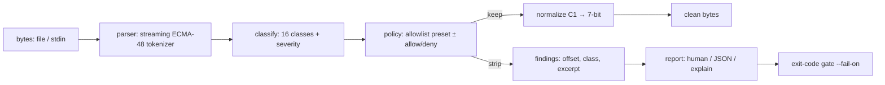

# seqsafe

[English](README.md) | [中文](README.zh.md) | [日本語](README.ja.md)

[](LICENSE) [](Cargo.toml) [](CHANGELOG.md) [](tests/) [](CONTRIBUTING.md)

**开源的不可信终端输出净化器 —— 保留颜色与安全样式，剥除剪贴板写入、标题篡改、设备查询与转义序列注入伎俩，白名单策略、零依赖。**


```bash
git clone https://github.com/JaydenCJ/seqsafe.git && cargo install --path seqsafe
```

## 为什么选 seqsafe？

终端会执行它所显示的内容。一行日志、一份 `curl` 下来的 README、一段 LLM 输出，都可能携带转义序列：把命令写进你的剪贴板（OSC 52）、改掉窗口标题、让终端向 stdin 应答（DECRQSS 回显攻击者字节曾是真实的终端 CVE）、重映射字符集让你审计过的字节渲染成别的东西、或者光标跳回去改写你刚确认过的那一行 —— 而重度使用 agent 的工作流正把越来越多不可信字节灌进越来越多的终端。现有方案是全有或全无：`strip-ansi` 和正则一行流会删掉*一切*，构建日志从此一片灰，却依然漏掉 8 位 C1 引导符（`0x9B` 不需要 ESC）和宽容终端照样解释的半开序列。seqsafe 把它当成真正的安全问题来做：流式 ECMA-48 解析器接 16 类语义分类器，白名单策略只保留你选择的部分（SGR 样式、安全 scheme 的超链接），其余一律剥除 —— 包括尚未被发明的序列，因为未知即剥除。`scan` 带严重度报告里面藏了什么，并提供面向流水线的 JSON 与退出码闸门。

|  | seqsafe | strip-ansi | sed/grep 正则 | less -R |
|---|---|---|---|---|
| 过滤时保留颜色 | 是（白名单） | 否（全部剥除） | 手搓、脆弱 | 是 |
| 剥除 OSC 52 剪贴板 / 标题 / 查询 | 是，按类 | 是（连同一切） | 通常漏掉 | 否（原样写出） |
| 8 位 C1 引导符（`0x9B` 等） | 是，UTF-8 感知 | 仅 CSI | 否 | 部分 |
| 截断 / 拼接序列防御 | 是（默认拒绝） | 否 | 否 | 否 |
| 发现报告 + 退出码闸门 | 是（`scan --json --fail-on`） | 否 | 否 | 否 |
| 超链接 scheme 校验 | 是（OSC 8 白名单） | 剥除 | 否 | 否 |
| 运行时依赖 | 0 个 crate | Node 运行时 | – | – |

<sub>对比截至 2026-07-13：npm 的 `strip-ansi` 7.x 删除其正则匹配的一切 —— 其模式确实覆盖 8 位 CSI 引导符 `0x9B`，但不覆盖 8 位 OSC/DCS（`0x9D`、`0x90` 等）与截断序列；`less -R` 原样输出 SGR、只对它认识的做插入符转义。seqsafe 为纯 std Rust。</sub>

## 特性

- **留下好的，剥掉坏的** —— SGR 颜色/加粗/下划线与安全 scheme 的 OSC 8 超链接原样通过；剪贴板写入、标题篡改、调色板替换、模式切换、字符集重映射、重置与设备查询统统出局。
- **设计上默认拒绝** —— 策略是白名单：未知序列、本版本之后才发明的序列、以及任何被截断、超长或被控制字节拼接的东西都会被剥除，绝不放行。
- **封堵 C1 绕过** —— 原始 8 位引导符（`0x9B` CSI、`0x9D` OSC 等）与其 ESC 孪生同样解析，但绝不误读 UTF-8 连续字节，日本語和 émoji 逐字节原样通过。
- **审计轨迹，而非只删除** —— 每次移除都是一条发现：字节偏移、行号、类别、严重度和控制字节转义的摘录；`explain` 附带原因，`--mark` 在原位留下可见的 `⟨stripped:...⟩` 占位符。
- **流水线闸门** —— `scan --fail-on critical` 恰在该失败时以 1 退出，`--json` 给网关结构化证据；存储的发现上限 1000 条，恶意输入撑不爆内存。
- **流式、零依赖** —— 推式解析器配有界缓冲，以 64 KiB 块处理 GB 级日志，任意切块方式输出完全一致；整个工具是纯 std Rust。

## 快速上手

安装（需要 Rust 1.75+）：

```bash
git clone https://github.com/JaydenCJ/seqsafe.git && cargo install --path seqsafe
```

扫描随附的攻击语料 —— 七行看起来人畜无害的发布说明：

```bash
seqsafe scan examples/poisoned.log
```

输出（取自真实运行）：

```text
L2 @87 [critical] clipboard (clipboard-write) stripped  ⟨ESC⟩]52;c;Y3VybCAtcyBodHRwOi8vZXZpbC5leGFtcGxlLnRlc…
L3 @148 [high] title (title-set) stripped  ⟨ESC⟩]0;security scan passed⟨BEL⟩
L4 @234 [medium] cursor (cursor-move) stripped  ⟨ESC⟩[2A
L4 @238 [medium] screen (erase-line) stripped  ⟨ESC⟩[2K
L4 @242 [medium] cursor (cursor-move) stripped  ⟨ESC⟩[1B
L4 @264 [medium] cursor (cursor-move) stripped  ⟨ESC⟩[1B
L5 @338 [medium] hyperlink (unsafe-link) stripped  ⟨ESC⟩]8;;file:///etc/passwd⟨ESC⟩\
L6 @398 [high] charset (charset-designate) stripped  ⟨ESC⟩(0
L6 @407 [high] charset (charset-designate) stripped  ⟨ESC⟩(B
L7 @453 [high] query (device-status-report) stripped  ⟨0x9B⟩6n
L7 @456 [medium] screen (erase-display) stripped  ⟨0x9B⟩2J
11 finding(s): 1 critical, 4 high, 6 medium, 0 low; 7 sequence(s) kept, 11 stripped; 496 bytes in, 358 bytes out
```

退出码为 1（存在 critical 发现），所以 `scan` 可以直接当 CI/网关闸门用。净化就是一根管道 —— 颜色留下，攻击出局，`--mark` 展示手术痕迹：

```bash
$ printf 'deploy \x1b[1;32mdone\x1b[0m\x1b]52;c;cm0gLXJmIH4=\x07 in 3s\n' | seqsafe clean --mark
deploy done⟨stripped:clipboard-write⟩ in 3s
```

典型接法：`make 2>&1 | seqsafe`、`ssh host 'journalctl -u app' | seqsafe`，或夹在 AI agent 的工具输出与渲染它的终端之间。管道里不带子命令的 `seqsafe` 就是 `seqsafe clean`，选项照常生效，如 `… | seqsafe --policy strict`。

## 策略

用 `--policy` 选预设，再用 `--allow` / `--deny` 微调（完整的类 → 序列映射见 [docs/classes.md](docs/classes.md)，或运行 `seqsafe classes`）：

| 策略 | 保留 | 额外行为 |
|---|---|---|
| `default` | `sgr`、`hyperlink`（仅 http/https/mailto） | 允许孤立 `\r`（进度条） |
| `strict` | `sgr` | 丢弃孤立 `\r`（杀死行改写伎俩） |
| `plain` | 无 | 输出纯文本，等价 strip-ansi |

```bash
seqsafe clean --policy strict --deny sgr --allow cursor,screen   # TUI passthrough, no colors
seqsafe clean --link-schemes https                               # https links only
seqsafe scan --json --fail-on high < untrusted.txt               # gate at high severity
```

`malformed` 是唯一不能 `--allow` 的类：截断或拼接的序列没有可以安全重发的形式。

## 验证

本仓库不带 CI；以上每一条主张都由本地运行验证：`cargo test`（81 个单元 + 9 个 CLI 集成测试，全部离线且确定性）和 `bash scripts/smoke.sh` —— 后者构建二进制并把一份投毒日志推过每个子命令（包括逐字节滴灌的管道以证明分块边界安全），必须打印 `SMOKE OK`。

## 架构



## 路线图

- [x] 核心引擎：流式解析器、16 类分类器、白名单策略、超链接校验、C1 归一化、scan/clean/explain/classes CLI、JSON 报告、退出码闸门
- [ ] `tui` 预设：额外保留 cursor/screen/mode 类，供全屏程序透传
- [ ] 库 crate 打磨：稳定的公开 API 文档与 `no_std + alloc` 核心
- [ ] SGR 子集过滤（例如保留颜色但去掉闪烁/隐藏）与按类自定义 `--mark` 样式
- [ ] Windows 控制台（VT 输入怪癖）测试覆盖

完整列表见 [open issues](https://github.com/JaydenCJ/seqsafe/issues)。

## 贡献

欢迎贡献 —— 见 [CONTRIBUTING.md](CONTRIBUTING.md)，可从 [good first issue](https://github.com/JaydenCJ/seqsafe/issues?q=is%3Aissue+is%3Aopen+label%3A%22good+first+issue%22) 入手，或发起 [discussion](https://github.com/JaydenCJ/seqsafe/discussions)。过滤器绕过属于安全漏洞：请走私密渠道报告（见 CONTRIBUTING.md 的 Security 一节）。

## 许可证

[MIT](LICENSE)
